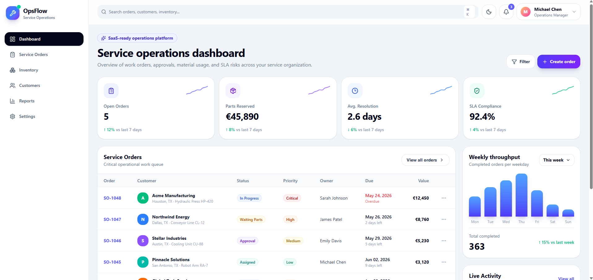
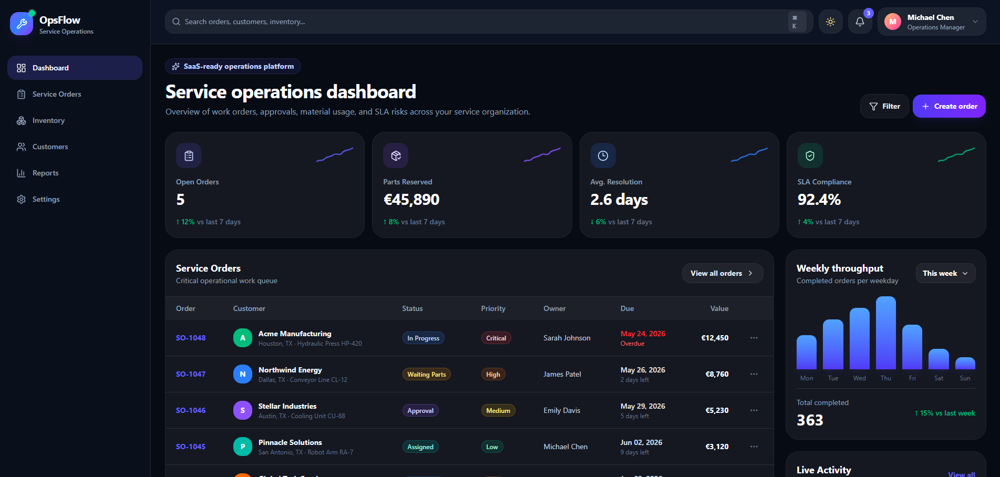

# OpsFlow — Service Operations Dashboard

## Live demo link: 

opsflow-service-operations.vercel.app

## Repository

https://https://github.com/rreshetniak/opsflow-service-operations

OpsFlow is a modern service operations dashboard built with React, Vite and Tailwind CSS.

The project demonstrates a professional B2B SaaS-style frontend application for managing service orders, inventory, customers, reports and operational activity.

## Features

- Light and dark theme
- Responsive sidebar navigation
- Service operations dashboard
- KPI cards
- Searchable service orders table
- Create service order modal
- Inventory overview
- Customers overview
- Reports page
- Activity feed
- Modern B2B SaaS UI

## Tech Stack

- React
- Vite
- Tailwind CSS
- Framer Motion
- Lucide React

## Pages

- Dashboard
- Service Orders
- Inventory
- Customers
- Reports
- Settings

## Screenshots

### Light Theme



### Dark Theme




## Run Locally

```bash
npm install
npm run dev
