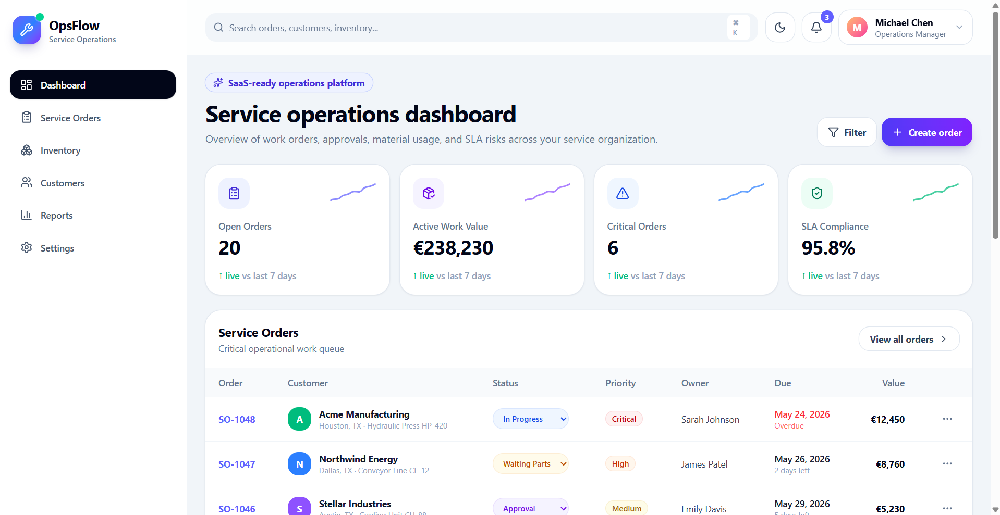
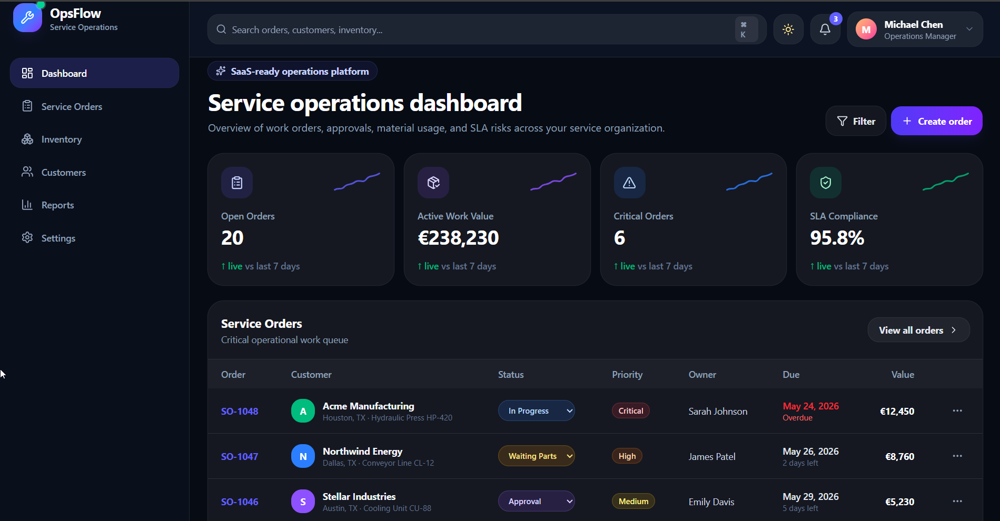
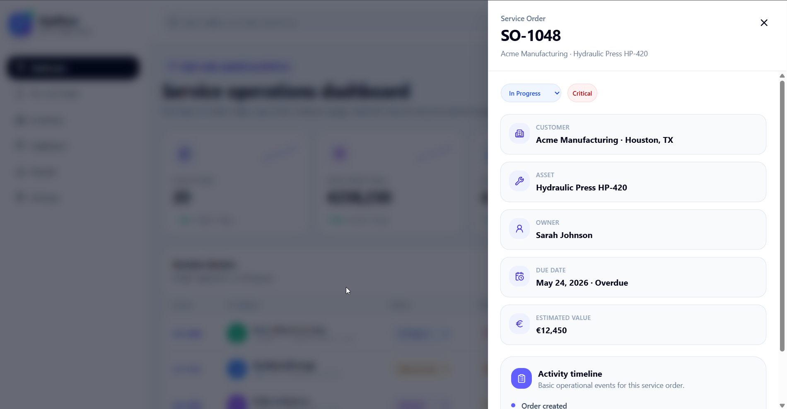
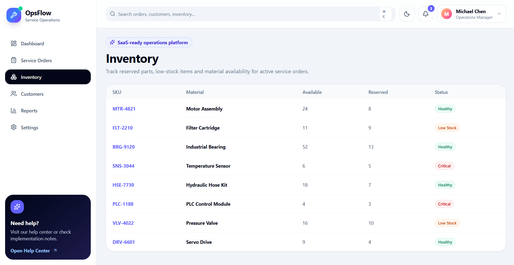
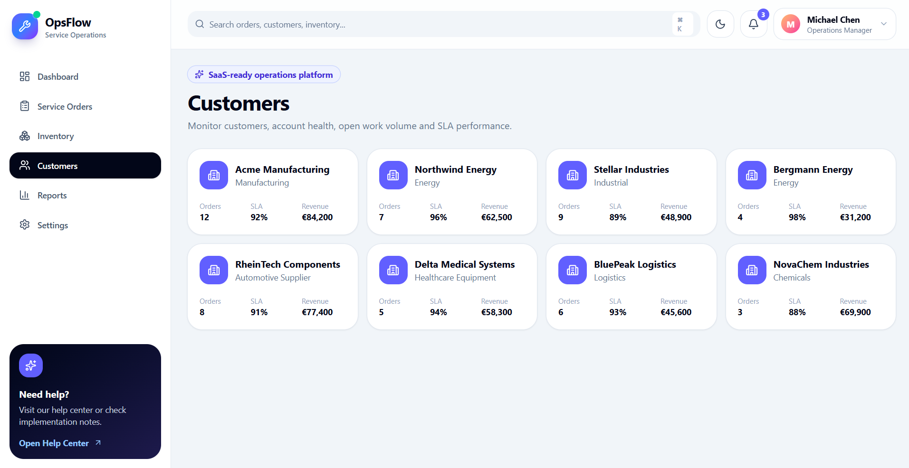
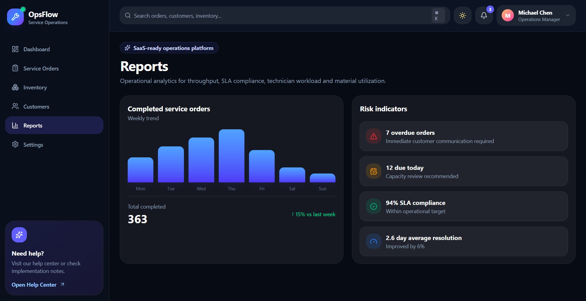
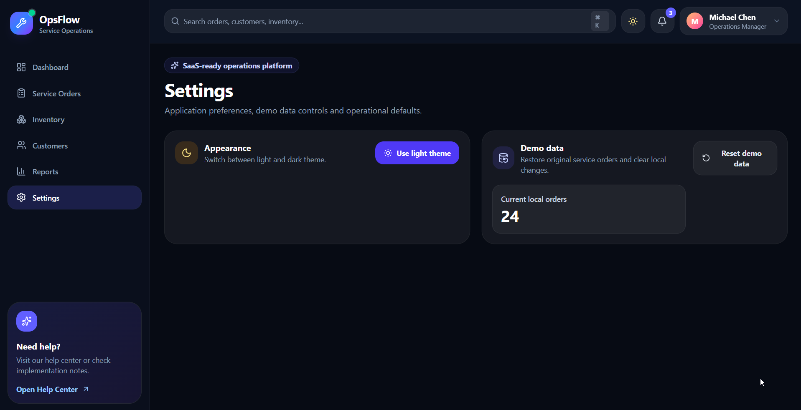

# OpsFlow — Service Operations Dashboard

OpsFlow is a modern B2B service operations dashboard built with React, Vite and Tailwind CSS.

The project demonstrates a professional SaaS-style frontend application for managing service orders, operational activity, customer work queues, status updates, filters, local demo data and dashboard metrics.

## Live Demo

https://opsflow-service-operations.vercel.app

## Repository

https://github.com/rreshetniak/opsflow-service-operations

## Features

- Light and dark theme
- Route-based navigation with React Router
- Responsive sidebar navigation
- Service operations dashboard
- Data-driven KPI cards
- Interactive throughput analytics card
- Live activity widget and activity drawer
- Service orders table
- Create service order flow
- Update service order status
- Delete service orders with confirmation dialog
- Order details drawer
- Filters by status and priority
- CSV export
- Pagination
- Topbar notifications menu
- User profile menu
- Persistent localStorage demo data
- Reset demo data action
- Empty states for filtered and empty order lists
- Vercel deployment-ready SPA routing

## Tech Stack

- React
- Vite
- Tailwind CSS
- React Router
- Framer Motion
- Lucide React
- LocalStorage persistence

## Routes

- `/` — Dashboard
- `/orders` — Service Orders
- `/inventory` — Inventory
- `/customers` — Customers
- `/reports` — Reports
- `/settings` — Settings

## Screenshots

### Dashboard — Light Theme



### Dashboard — Dark Theme



### Service Orders — Dark Theme


### Order Details Drawer



### Inventory — Light Theme



### Customers — Light Theme



### Reports — Dark Theme



### Settings — Dark Theme



## Project Structure

```text
src/
  components/
    dashboard/
    layout/
    orders/
    ui/
  data/
  pages/
  utils/
  App.jsx
  main.jsx
  index.css